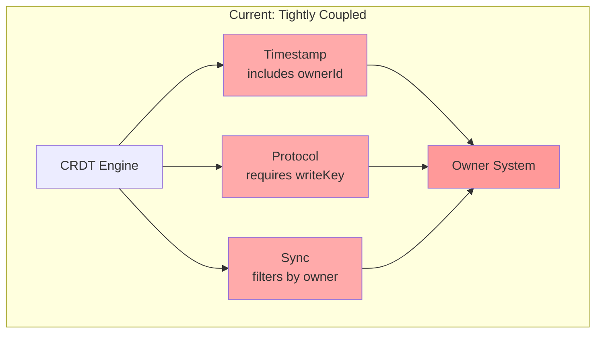
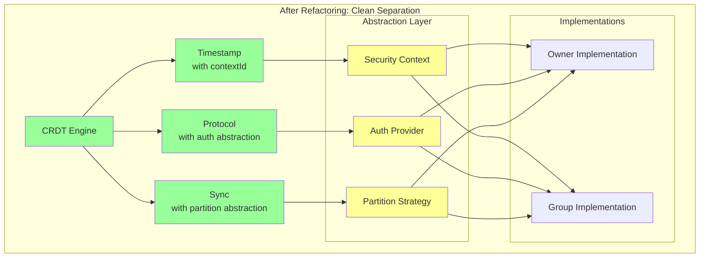

# Phase 0: Refactoring - Decoupling CRDT from Owner System

## Overview

Before attempting the teardown approach for Evolu Groups, we need to address the fundamental issue: **CRDT logic is tightly coupled with the owner-based security model**. This refactoring phase will create clean separation of concerns, reducing the risk of CRDT extraction from "high" to "low".

## The Problem

Currently, the CRDT implementation has deep dependencies on the owner system:



## The Solution

Introduce abstraction layers that allow CRDT to work with any security context:



## Refactoring Steps

### Step 1: Define Security Abstractions

Create new interfaces that CRDT can depend on without knowing about owners or groups:

```typescript
// packages/common/src/Evolu/SecurityAbstractions.ts

interface SecurityContext {
  readonly id: string;
  readonly type: "owner" | "group" | "plaintext";
  
  // Used by timestamps
  createNodeId(): NodeId;
  
  // Used for partitioning
  getPartitionKey(): string;
}

interface AuthProvider {
  // Used by protocol
  createAuthProof(message: Uint8Array): Promise<AuthProof>;
  verifyAuthProof(message: Uint8Array, proof: AuthProof): Promise<boolean>;
}

interface EncryptionProvider {
  encrypt(data: Uint8Array, context: SecurityContext): Promise<Uint8Array>;
  decrypt(data: Uint8Array, context: SecurityContext): Promise<Uint8Array>;
}

interface PartitionStrategy {
  // Used by sync
  shouldSync(context: SecurityContext, otherContext: SecurityContext): boolean;
  canAccess(context: SecurityContext, data: EncryptedData): boolean;
}
```

### Step 2: Refactor Timestamp

Current timestamp includes ownerId directly:

```typescript
// BEFORE: Tightly coupled
interface Timestamp {
  readonly node: NodeId; // Derived from ownerId
  readonly counter: Counter;
}

// AFTER: Context-based
interface Timestamp {
  readonly node: NodeId; // Derived from context.createNodeId()
  readonly counter: Counter;
}
```

### Step 3: Refactor Protocol

Current protocol requires owner-specific fields:

```typescript
// BEFORE: Owner-specific
interface ProtocolMessage {
  readonly ownerId: BinaryOwnerId;
  readonly writeKey: WriteKey;
  readonly changes: DbChange[];
}

// AFTER: Abstract auth
interface ProtocolMessage {
  readonly contextId: string;
  readonly authProof: AuthProof;
  readonly changes: DbChange[];
}
```

### Step 4: Refactor Sync

Current sync filters by owner:

```typescript
// BEFORE: Owner-aware
function syncMessages(local: Owner, remote: Messages) {
  return remote.filter(msg => 
    msg.ownerId === local.id || 
    local.sharedOwners.includes(msg.ownerId)
  );
}

// AFTER: Strategy-based
function syncMessages(
  context: SecurityContext, 
  strategy: PartitionStrategy,
  remote: Messages
) {
  return remote.filter(msg => 
    strategy.shouldSync(context, msg.context)
  );
}
```

### Step 5: Create Adapter Implementations

Implement the abstractions for the current owner system:

```typescript
// packages/common/src/Evolu/OwnerAdapters.ts

class OwnerSecurityContext implements SecurityContext {
  constructor(private owner: Owner) {}
  
  get id() { return this.owner.id; }
  get type() { return "owner" as const; }
  
  createNodeId() {
    return createNodeIdFromOwner(this.owner);
  }
  
  getPartitionKey() {
    return this.owner.id;
  }
}

class OwnerAuthProvider implements AuthProvider {
  constructor(private owner: Owner) {}
  
  async createAuthProof(message: Uint8Array) {
    return signWithWriteKey(message, this.owner.writeKey);
  }
  
  async verifyAuthProof(message: Uint8Array, proof: AuthProof) {
    return verifyWriteKey(message, proof);
  }
}
```

### Step 6: Update CRDT Engine

Modify CRDT to use abstractions instead of direct owner references:

```typescript
// BEFORE
class CRDTEngine {
  constructor(private owner: Owner) {}
  
  createTimestamp(): Timestamp {
    return {
      node: createNodeIdFromOwner(this.owner),
      counter: this.getNextCounter()
    };
  }
}

// AFTER
class CRDTEngine {
  constructor(
    private context: SecurityContext,
    private auth: AuthProvider
  ) {}
  
  createTimestamp(): Timestamp {
    return {
      node: this.context.createNodeId(),
      counter: this.getNextCounter()
    };
  }
}
```

## Testing Strategy

### 1. Create Abstract Tests

Write tests against the abstractions:

```typescript
describe("CRDT with abstract security", () => {
  test("works with mock context", () => {
    const mockContext: SecurityContext = {
      id: "test",
      type: "plaintext",
      createNodeId: () => "test-node",
      getPartitionKey: () => "test"
    };
    
    const crdt = new CRDTEngine(mockContext, mockAuth);
    // Test CRDT operations work correctly
  });
});
```

### 2. Verify Backward Compatibility

Ensure owner-based implementation still works:

```typescript
test("owner adapter maintains compatibility", () => {
  const owner = createOwner();
  const context = new OwnerSecurityContext(owner);
  const crdt = new CRDTEngine(context, new OwnerAuthProvider(owner));
  
  // All existing tests should pass
});
```

### 3. Test Isolation

Verify CRDT has no direct owner dependencies:

```typescript
// This should compile and run without importing Owner types
import { CRDTEngine } from "./CRDT";
import type { SecurityContext } from "./SecurityAbstractions";
```

## Success Criteria

1. **No Direct Dependencies**: CRDT modules don't import Owner types
2. **Abstract Tests Pass**: CRDT works with mock security contexts
3. **Backward Compatible**: Existing Evolu apps continue working
4. **Performance Neutral**: No significant performance regression
5. **Clean Boundaries**: Clear interfaces between layers

## Benefits

1. **Reduced Risk**: CRDT extraction becomes low risk
2. **Better Architecture**: Clean separation of concerns
3. **Reusability**: Same CRDT can power both Evolu and Evolu Groups
4. **Testability**: Can test CRDT logic in isolation
5. **Flexibility**: Easy to add new security models

## Timeline Estimate

- **Week 1**: Define abstractions and create owner adapters
- **Week 2**: Refactor Timestamp and Protocol
- **Week 3**: Refactor Sync and CRDT Engine
- **Week 4**: Testing and verification

## Next Steps

After Phase 0 completion:
1. CRDT extraction risk drops from "high" to "low"
2. Phase 1 teardown can proceed with confidence
3. Clean CRDT module ready for Evolu Groups

This refactoring is an investment that benefits both the existing Evolu and the new Evolu Groups project.