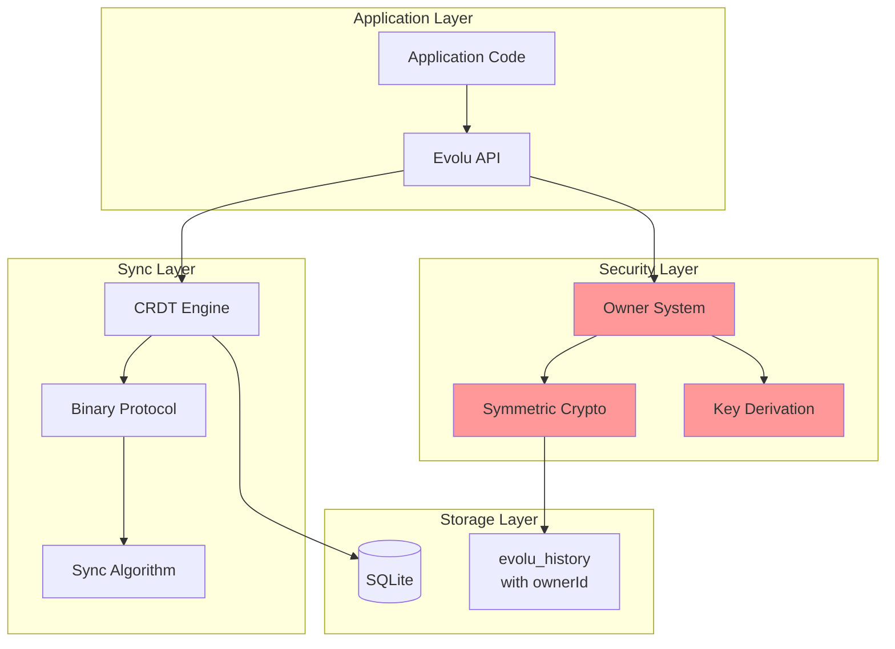
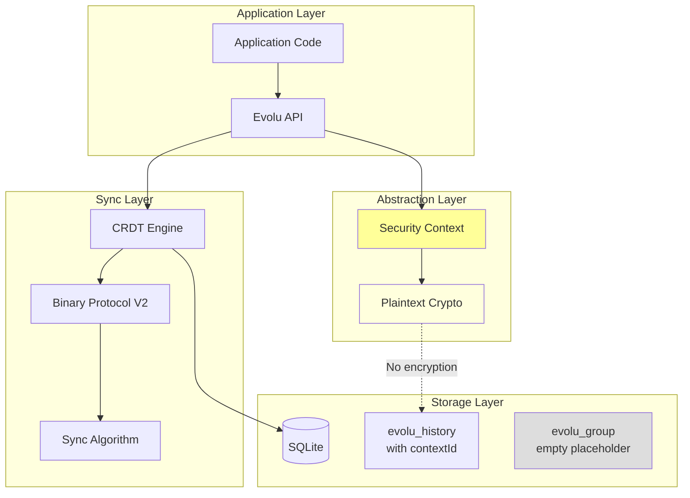
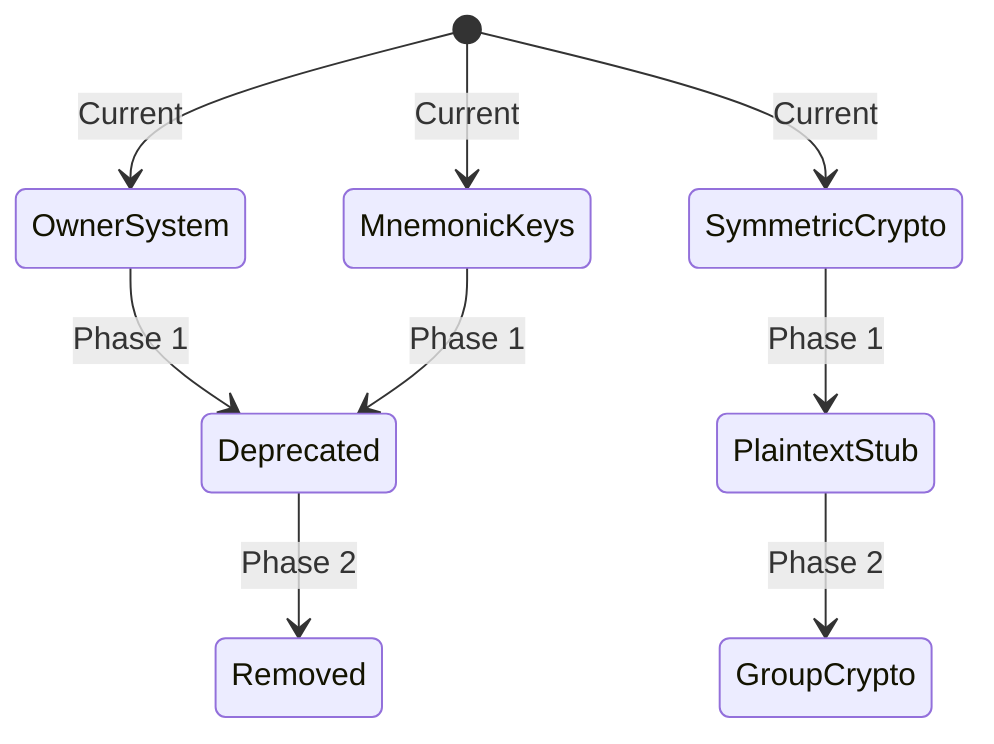
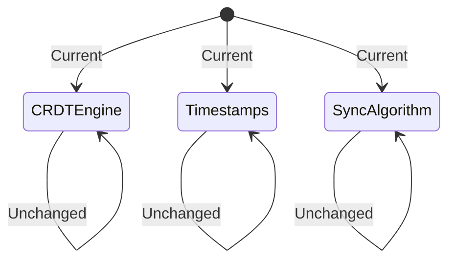
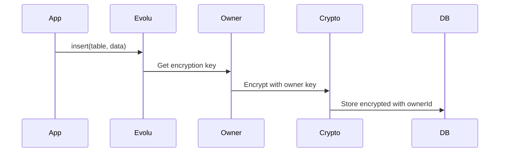
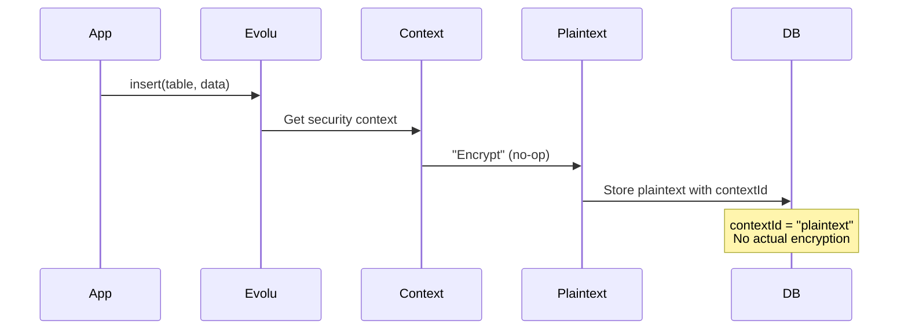
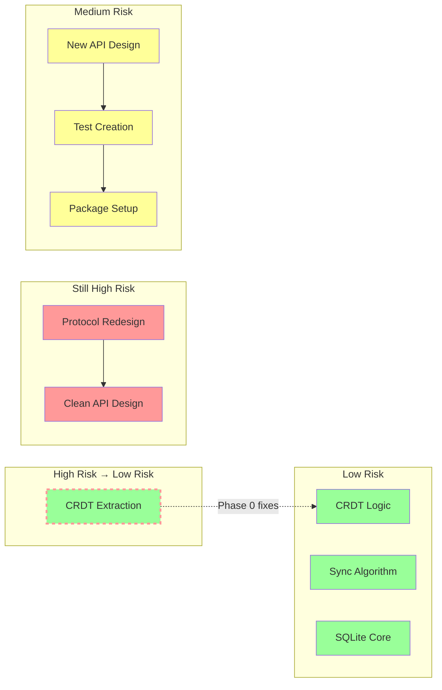

# Phase 1: Architecture Transformation

## Prerequisites: Phase 0 Refactoring

Before Phase 1 can begin, Phase 0 refactoring must be complete:
- ✅ Security abstractions (SecurityContext, AuthProvider) defined
- ✅ CRDT decoupled from owner system
- ✅ Owner adapters implementing abstractions
- ✅ All tests passing with new abstractions
- ✅ Clean separation verified between CRDT and security layers

See `docs/groups/phase-0-refactoring.md` for details.

## Before: Owner-Based Architecture



## After Phase 1: Plaintext Foundation



## Component State Transitions

### Removed Components


### Preserved Components


## Data Flow Transformation

### Current Data Flow


### Phase 1 Data Flow


## Protocol Evolution

### Message Structure Changes
```typescript
// BEFORE: Owner-based
interface ProtocolMessage {
  ownerId: BinaryOwnerId;
  writeKey: WriteKey;
  changes: DbChange[];
}

// PHASE 1: Context-based
interface ProtocolMessageV2 {
  contextId: string;        // Always "plaintext" in Phase 1
  authProof?: never;        // Removed
  changes: DbChangeV2[];    // Updated structure
}
```

## Database Schema Evolution

### evolu_history Changes
```sql
-- BEFORE
CREATE TABLE evolu_history (
  "ownerId" BLOB NOT NULL,
  "table" TEXT NOT NULL,
  "id" BLOB NOT NULL,
  "column" TEXT NOT NULL,
  "timestamp" BLOB NOT NULL,
  "value" ANY
);

-- PHASE 1 (clean slate)
CREATE TABLE evolu_history (
  "contextId" TEXT NOT NULL,     -- Always "plaintext" in Phase 1
  "table" TEXT NOT NULL,
  "id" BLOB NOT NULL,
  "column" TEXT NOT NULL,
  "timestamp" BLOB NOT NULL,
  "value" ANY                    -- Stored in plaintext
);
```

## API Surface

### Evolu Groups API (New System)
```typescript
// Clean, new API - no legacy methods
interface EvoluGroups {
  insert<T>(table: string, data: T): Result<Id, Error>;
  update<T>(table: string, id: Id, data: T): Result<void, Error>;
  delete(table: string, id: Id): Result<void, Error>;
  query<T>(query: Query<T>): Promise<T[]>;
  sync(): Promise<void>;
  getSecurityContext(): SecurityContext; // { type: "plaintext", id: "plaintext" }
}
```

## Testing Strategy Transformation

### Before: Owner-Centric Tests
```typescript
test("owner can decrypt their data", () => {
  const owner = createAppOwner();
  const encrypted = encrypt(data, owner.encryptionKey);
  const decrypted = decrypt(encrypted, owner.encryptionKey);
  expect(decrypted).toEqual(data);
});
```

### Phase 1: Plaintext Tests
```typescript
test("data flows through plaintext", () => {
  const context = getDefaultSecurityContext();
  const "encrypted" = encrypt(data, context); // No-op
  const "decrypted" = decrypt("encrypted", context); // No-op
  expect("decrypted").toEqual(data);
  expect("encrypted").toEqual(data); // Same!
});
```

## Risk Areas (After Phase 0 Refactoring)



### Risk Mitigation Through Refactoring

**CRDT Extraction**: Originally high risk due to tight coupling with owner system. Phase 0 refactoring introduces abstractions that decouple CRDT from security concerns, reducing this to low risk.

**Why This Matters**:
- Can test CRDT with mock security contexts before extraction
- Clear interfaces prevent accidental coupling during development
- Both Evolu and Evolu Groups benefit from cleaner architecture
- Extraction becomes mechanical rather than architectural

## Success Metrics

| Metric | Target | Measurement |
|--------|--------|-------------|
| Test Coverage | >90% | Jest coverage report |
| Performance | <5% regression | Benchmark suite |
| Clean Start Success | 100% | Integration tests |
| API Completeness | 100% | All features implemented |
| CRDT Function | 100% preserved | Sync tests |