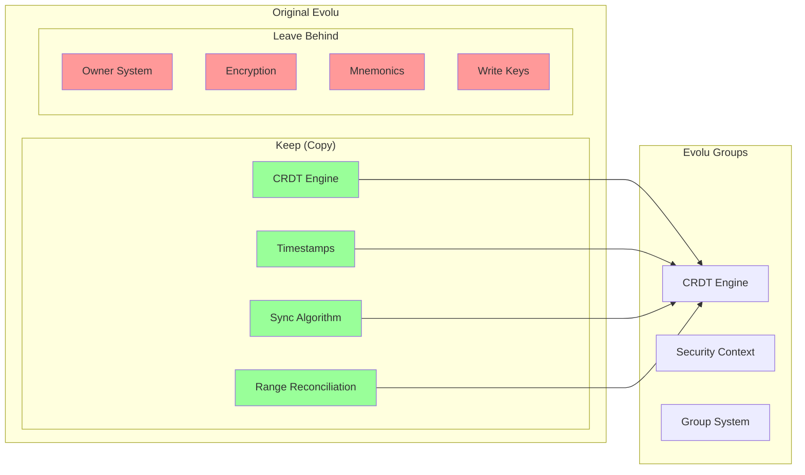

# Phase 1: Clean Slate Design - Evolu Groups

## Philosophy

This is not an evolution of Evolu, but a **revolution**. We're building Evolu Groups from scratch, taking only the brilliant CRDT synchronization engine and leaving behind all owner-based security concepts.

## Prerequisites: Phase 0 Completion

Thanks to Phase 0 refactoring, CRDT extraction is now **low risk**:
- CRDT no longer directly depends on owner concepts
- Clean interfaces (SecurityContext, AuthProvider) established
- Abstraction layer tested and verified
- Both Evolu and Evolu Groups can share the same CRDT core

This makes the "clean slate" approach much safer and more achievable.

## What We Keep vs What We Leave

### Extract from Original Evolu


## New Package Structure

```
@evolu/groups/
├── src/
│   ├── core/
│   │   ├── Timestamp.ts      # Copied from original
│   │   ├── CRDT.ts          # Copied and simplified
│   │   └── Sync.ts          # Copied from original
│   ├── security/
│   │   ├── Context.ts       # New: Security context abstraction
│   │   ├── Plaintext.ts     # Phase 1: No-op crypto
│   │   └── Group.ts         # Phase 2: Group interfaces (empty)
│   ├── protocol/
│   │   └── Protocol.ts      # Simplified without ownership
│   └── EvoluGroups.ts       # Main API
├── test/
└── package.json
```

## Core Design Decisions

### 1. No Backward Compatibility
```typescript
// Not this:
interface EvoluGroups extends Evolu { ... }

// But this:
interface EvoluGroups {
  // Completely new API surface
  insert<T>(table: string, data: T): Result<Id, Error>;
  query<T>(query: Query<T>): Promise<T[]>;
  sync(): Promise<void>;
}
```

### 2. Context-First Design
```typescript
// Phase 1: Everything is plaintext
type SecurityContext = {
  type: "plaintext";
  id: "global";
};

// Phase 2: Group contexts
type SecurityContext = {
  type: "group";
  groupId: GroupId;
  epoch: EpochNumber;
};
```

### 3. Simplified Protocol
```typescript
// Original Evolu protocol
interface ProtocolMessage {
  ownerId: BinaryOwnerId;
  writeKey: WriteKey;
  // ... complex ownership proof
}

// Evolu Groups protocol
interface GroupProtocolMessage {
  contextId: string;
  changes: Change[];
  // Phase 2 will add: groupProof
}
```

## Database Schema (Fresh Start)

```sql
-- No evolu_owner table at all!

CREATE TABLE evolu_history (
  "contextId" TEXT NOT NULL,
  "table" TEXT NOT NULL,
  "id" BLOB NOT NULL,
  "column" TEXT NOT NULL,
  "timestamp" BLOB NOT NULL,
  "value" ANY
) STRICT;

-- Ready for Phase 2
CREATE TABLE evolu_group (
  "id" TEXT NOT NULL PRIMARY KEY,
  "epoch" INTEGER NOT NULL,
  "metadata" TEXT NOT NULL
) STRICT;

CREATE TABLE evolu_group_epoch (
  "groupId" TEXT NOT NULL,
  "epoch" INTEGER NOT NULL,
  "keyMaterial" BLOB NOT NULL,
  "createdAt" TEXT NOT NULL,
  PRIMARY KEY ("groupId", "epoch")
) STRICT;
```

## Implementation Strategy

### Step 1: Copy CRDT Core (Week 1)
```bash
# Create new package
mkdir packages/evolu-groups
cd packages/evolu-groups

# Copy only what we need
cp ../common/src/Evolu/Timestamp.ts src/core/
cp ../common/src/Evolu/Sync.ts src/core/
# ... etc
```

### Step 2: Use Refactored CRDT
```typescript
// Thanks to Phase 0, CRDT already uses abstractions
import { CRDTEngine, SecurityContext } from "@evolu/common/crdt";

// Create plaintext context for Phase 1
const plaintextContext: SecurityContext = {
  type: "plaintext",
  id: "global",
  createNodeId: () => "plaintext-node",
  getPartitionKey: () => "global"
};

// CRDT works without knowing about owners or groups!
const crdt = new CRDTEngine(plaintextContext, plaintextAuth);
```

### Step 3: Build New API
```typescript
export function createEvoluGroups<S extends Schema>(
  schema: S,
  config?: GroupConfig
): EvoluGroups<S> {
  // No owner creation
  // No mnemonic handling
  // Just pure CRDT sync with contexts
}
```

## Phase 1 Deliverables

### Working System With:
- ✅ CRDT synchronization
- ✅ Timestamp-based conflict resolution
- ✅ SQLite storage
- ✅ Plaintext operation (no encryption)
- ✅ Context-based data partitioning

### Without:
- ❌ Any owner concepts
- ❌ Encryption
- ❌ Mnemonics
- ❌ Write keys
- ❌ Group security (yet)

## Testing Approach

```typescript
describe("Evolu Groups Phase 1", () => {
  test("synchronizes plaintext data", async () => {
    const node1 = createEvoluGroups(schema);
    const node2 = createEvoluGroups(schema);
    
    await node1.insert("items", { name: "test" });
    await sync(node1, node2);
    
    const items = await node2.query(q => q.selectFrom("items"));
    expect(items).toHaveLength(1);
  });
  
  test("no encryption in Phase 1", async () => {
    const evolu = createEvoluGroups(schema);
    await evolu.insert("secrets", { password: "plaintext" });
    
    // Direct DB access shows plaintext
    const db = await getRawDatabase();
    const row = db.get("SELECT value FROM evolu_history");
    expect(row.value).toBe("plaintext"); // Not encrypted!
  });
});
```

## Developer Experience

### Clean, Simple API
```typescript
// Phase 1: Dead simple
const evolu = createEvoluGroups(schema);
await evolu.insert("todos", { title: "Build groups" });

// Phase 2 preview: Still simple
const evolu = createEvoluGroups(schema, { group: myGroup });
await evolu.insert("todos", { title: "Encrypted by group" });
```

### Clear Separation
```typescript
// This is not Evolu v3
// This is Evolu Groups v1

import { createEvoluGroups } from "@evolu/groups"; // New package
import { createEvolu } from "@evolu/common";       // Still exists
```

## Why This Approach?

1. **Clean Architecture**: No legacy owner concepts polluting the design
2. **Faster Development**: No compatibility constraints
3. **Better Testing**: Can test CRDT in isolation from security
4. **Clear Mental Model**: Groups-first, not retrofitted

## Next: Phase 2 Preview

With Phase 1's clean foundation, Phase 2 can implement:
- Group entity management
- Epoch-based encryption
- Multi-admin consensus
- Forward secrecy
- Disappearing messages

All without any owner legacy to work around!