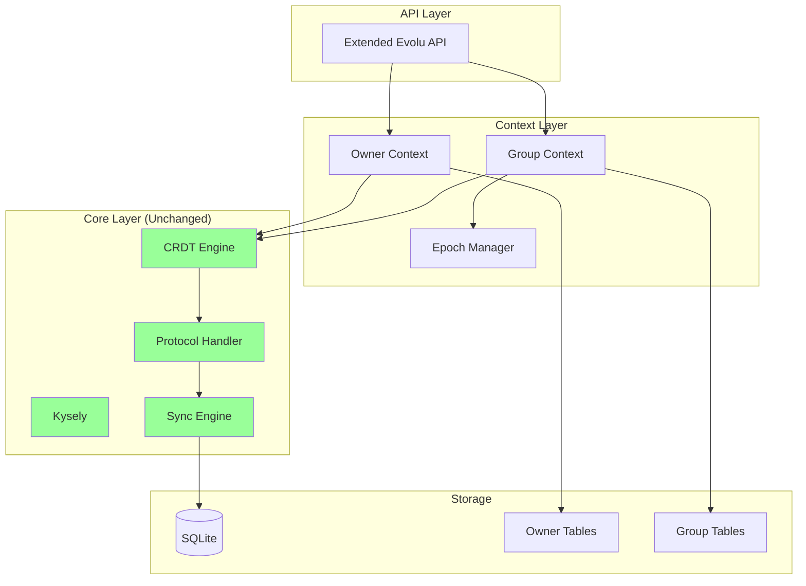

# Phase 1 Design: Extending Evolu with Groups

## 1. Overview

Phase 1 extends Evolu with group support through incremental refactoring, preserving 70-80% of the battle-tested codebase while adding powerful multi-user features. This design builds on the Phase 0 abstractions to add group functionality without breaking existing owner-based features.

## 2. Core Strategy: Extend, Don't Replace

### 2.1 What We Reuse (70-80%)
- **CRDT Engine** - 100% reused via Phase 0 abstractions
- **Query System** - Kysely queries work unchanged
- **Event System** - Store subscriptions work unchanged  
- **Platform Adapters** - All platforms continue working
- **Binary Protocol** - Core encoding/decoding reused
- **SQLite Integration** - Database layer unchanged
- **Sync Algorithm** - RBSR works for both contexts

### 2.2 What We Add (20-30%)
- Group security contexts
- Epoch-based key management
- Multi-member authentication
- Group management APIs
- Extended protocol messages
- Group-specific tables

## 3. Architecture Design

### 3.1 Security Context Extension

```typescript
// Existing owner context continues to work
interface OwnerSecurityContext {
  type: "owner";
  owner: Owner;
}

// New group context added alongside
interface GroupSecurityContext {
  type: "group";
  groupId: GroupId;
  epochManager: EpochManager;
  
  createNodeId(): NodeId {
    // Include epoch in NodeId for uniqueness
    return createGroupNodeId(groupId, epochManager.currentEpoch);
  }
  
  getPartitionKey(): string {
    return `group:${groupId}:${epochManager.currentEpoch}`;
  }
}

// Both work with existing abstractions
type SecurityContext = OwnerSecurityContext | GroupSecurityContext;
```

### 3.2 Protocol Extension

```typescript
// Existing owner messages unchanged
interface OwnerProtocolMessage {
  type: "owner";
  ownerId: BinaryOwnerId;
  writeKey: WriteKey;
  changes: DbChange[];
}

// New group messages added
interface GroupProtocolMessage {
  type: "group";
  groupId: GroupId;
  epochId: EpochId;
  memberSignature: Signature;
  changes: DbChange[]; // Same format!
}

// Protocol handles both seamlessly
type ProtocolMessage = OwnerProtocolMessage | GroupProtocolMessage;
```

### 3.3 Database Schema Extension

```typescript
// Existing tables remain unchanged
// Add new tables for groups
const groupTables = {
  evolu_group: table({
    id: text().primaryKey(),
    name: text(),
    currentEpoch: integer().notNull(),
    createdAt: text().notNull(),
    createdBy: text().notNull(), // ownerId who created it
  }),
  
  evolu_group_member: table({
    groupId: text().notNull(),
    userId: text().notNull(), 
    role: text().notNull(), // 'admin' | 'member'
    publicKey: blob().notNull(),
    joinedAt: text().notNull(),
  }),
  
  evolu_epoch: table({
    groupId: text().notNull(),
    epochId: integer().notNull(),
    startedAt: text().notNull(),
    keyHash: blob().notNull(),
  }),
  
  evolu_epoch_key: table({
    groupId: text().notNull(),
    epochId: integer().notNull(),
    memberId: text().notNull(),
    encryptedKey: blob().notNull(),
  }),
};
```

### 3.4 API Design

```typescript
interface Evolu<S extends Schema = Schema> {
  // All existing methods remain unchanged...
  
  // Group management (new)
  createGroup(name: string): Promise<Group>;
  joinGroup(invite: GroupInvite): Promise<void>;
  leaveGroup(groupId: GroupId): Promise<void>;
  getCurrentGroup(): Group | null;
  listGroups(): Promise<ReadonlyArray<Group>>;
  
  // Enhanced mutations accept context
  create<T>(
    table: T, 
    data: Data,
    options?: { context?: SecurityContext }
  ): Id;
  
  // Feature detection
  readonly supportsGroups: boolean;
}
```

## 4. Key Design Decisions

### 4.1 Backward Compatibility First
- Existing code continues to work unchanged
- Groups are opt-in via configuration
- No breaking changes to public API
- Owner and group data coexist peacefully

### 4.2 Unified Message Protocol
- Single sync infrastructure handles both message types
- Messages tagged with type discriminator
- Routing based on context type
- Reuses existing binary encoding

### 4.3 Epoch Foundation (Not Full Implementation)
- Phase 1 tracks epochs but doesn't encrypt
- Lays groundwork for Phase 2 encryption
- Simple epoch incrementing initially
- Key distribution tables ready but unused

### 4.4 Incremental Adoption Path
```typescript
// Step 1: Use Evolu as before
const evolu = createEvolu(schema);

// Step 2: Enable groups when ready
const evolu = createEvolu(schema, { enableGroups: true });

// Step 3: Use both contexts as needed
evolu.create("todo", { text: "Personal" }); // Owner context
const group = await evolu.createGroup("Team");
evolu.create("todo", { text: "Team task" }, { context: group.context });
```

## 5. Component Interactions



## 6. Success Criteria

- **Code Reuse**: >70% of existing code unchanged
- **Backward Compatibility**: 100% - all existing tests pass
- **Performance**: <5% overhead for group operations
- **Type Safety**: Full TypeScript support maintained
- **Platform Support**: All platforms work without changes

## 7. Phase 2 Preview

Phase 1 establishes the foundation for Phase 2's security features:
- Epoch-based encryption activation
- Secure key distribution protocols
- Forward secrecy implementation
- Member invitation system
- Automatic epoch rotation

The clean separation between contexts makes Phase 2 a natural extension rather than a rewrite.