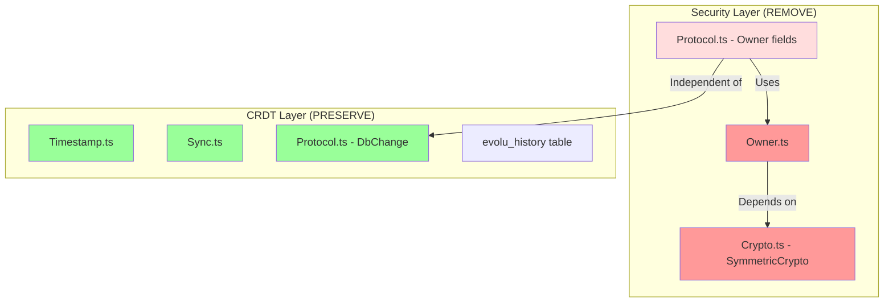

# Phase 1: Core Teardown - Detailed Design

## Overview

Phase 1 focuses on surgically removing Evolu's individual ownership model while preserving the CRDT synchronization engine. This creates a clean foundation for implementing group-based security in Phase 2.

## Current State Analysis

### Components to Remove



### Key Dependencies to Break

1. **Evolu.ts → Owner.ts**: Remove AppOwner creation and management
2. **Db.ts → Owner.ts**: Remove owner-based encryption in worker
3. **Protocol.ts → Owner.ts**: Remove OwnerId and WriteKey from messages

## Detailed Teardown Plan

### Step 1: Create Abstraction Layer

First, create interfaces that will bridge the old and new systems:

```typescript
// packages/common/src/Evolu/GroupAbstraction.ts

export interface SecurityContext {
  readonly type: "individual" | "group" | "plaintext";
  readonly id: string;
}

export interface PlaintextContext implements SecurityContext {
  readonly type: "plaintext";
  readonly id: "plaintext";
}

// Temporary adapter to make existing code work
export function ownerToSecurityContext(owner: Owner): SecurityContext {
  return {
    type: "individual",
    id: owner.id
  };
}

// For Phase 1, everything becomes plaintext
export function getDefaultSecurityContext(): PlaintextContext {
  return {
    type: "plaintext",
    id: "plaintext"
  };
}
```

### Step 2: Modify Core Interfaces

#### 2.1 Update MutationOptions

```typescript
// packages/common/src/Evolu/Schema.ts

export interface MutationOptions {
  readonly onComplete?: () => void;
  readonly onlyValidate?: boolean;
  // Replace owner with context
  readonly context?: SecurityContext; // Phase 1: always plaintext
}
```

#### 2.2 Update Protocol Messages

```typescript
// packages/common/src/Evolu/Protocol.ts

// Add new message format alongside old
export interface DbChangeV2 {
  readonly table: string;
  readonly id: Id;
  readonly values: Record<string, SqliteValue>;
  readonly contextId: string; // Replaces ownerId
}

// During migration, support both formats
export type DbChangeCompat = DbChange | DbChangeV2;
```

### Step 3: Gut the Encryption

#### 3.1 Create Plaintext Crypto

```typescript
// packages/common/src/Evolu/PlaintextCrypto.ts

export class PlaintextCrypto implements SymmetricCrypto {
  encrypt(data: Uint8Array): Result<EncryptedData, never> {
    // Phase 1: No encryption, just pass through
    return ok({
      ciphertext: data,
      nonce: new Uint8Array(0), // Empty nonce
      algorithm: "plaintext" as any
    });
  }

  decrypt(encrypted: EncryptedData): Result<Uint8Array, never> {
    return ok(encrypted.ciphertext);
  }
}
```

#### 3.2 Replace Crypto in Worker

```typescript
// packages/common/src/Evolu/Db.ts

// Replace this:
const crypto = createSymmetricCrypto(ownerRow.encryptionKey);

// With this:
const crypto = new PlaintextCrypto(); // Phase 1 simplification
```

### Step 4: New Database Schema

#### 4.1 New evolu_history structure

```sql
-- Phase 1: Simple history table without ownership
CREATE TABLE evolu_history (
  "contextId" TEXT NOT NULL DEFAULT 'plaintext',
  "table" TEXT NOT NULL,
  "id" BLOB NOT NULL,
  "column" TEXT NOT NULL,
  "timestamp" BLOB NOT NULL,
  "value" ANY
) STRICT;

-- Index for querying
CREATE INDEX evolu_history_contextId_timestamp ON evolu_history (
  "contextId",
  "timestamp"
);
```

#### 4.2 Create Group Tables (Empty for now)

```sql
-- Placeholder for Phase 2
CREATE TABLE evolu_group (
  "id" TEXT NOT NULL PRIMARY KEY,
  "name" TEXT,
  "createdAt" TEXT NOT NULL,
  "metadata" TEXT -- JSON blob for future use
) STRICT;

CREATE TABLE evolu_group_member (
  "groupId" TEXT NOT NULL,
  "userId" TEXT NOT NULL,
  "role" TEXT NOT NULL, -- 'admin' or 'member'
  "joinedAt" TEXT NOT NULL,
  PRIMARY KEY ("groupId", "userId")
) STRICT;
```

### Step 5: Create New Public API

#### 5.1 Fresh API Design

```typescript
// packages/groups/src/EvoluGroups.ts

export interface EvoluGroups<S extends Schema = Schema> {
  // Clean API - no owner concepts
  readonly insert: <T extends keyof S>(table: T, data: S[T]) => Result<Id, Error>;
  readonly update: <T extends keyof S>(table: T, id: Id, data: Partial<S[T]>) => Result<void, Error>;
  readonly delete: <T extends keyof S>(table: T, id: Id) => Result<void, Error>;
  readonly query: <R>(query: Query<R>) => Promise<R[]>;
  readonly sync: () => Promise<void>;
  readonly getSecurityContext: () => SecurityContext;
}
```

#### 5.2 Clean Implementation

```typescript
// Fresh implementation without legacy
export function createEvoluGroups<S extends Schema>(
  schema: S,
  config?: GroupConfig
): EvoluGroups<S> {
  const context = getDefaultSecurityContext(); // Always plaintext in Phase 1
  
  return {
    insert: (table, data) => {
      // Direct implementation, no owner checks
      return insertWithContext(table, data, context);
    },
    // ... other methods
  };
}
```

## Testing Strategy

### Phase 1 Test Plan

```typescript
describe("Phase 1: Plaintext Operation", () => {
  test("mutations work without encryption", async () => {
    const evolu = createEvolu(schema);
    
    // Should work even though no owner exists
    const result = evolu.insert("item", { name: "test" });
    expect(result.ok).toBe(true);
    
    // Data should be stored in plaintext
    const query = evolu.createQuery(db => db.selectFrom("item").selectAll());
    const data = await evolu.loadQuery(query);
    expect(data.rows[0].name).toBe("test");
  });
  
  test("sync works without encryption", async () => {
    // Two instances should sync plaintext data
    const evolu1 = createEvolu(schema);
    const evolu2 = createEvolu(schema);
    
    evolu1.insert("item", { name: "from1" });
    
    // After sync, evolu2 should see plaintext data
    await waitForSync();
    const items = await evolu2.loadQuery(allItems);
    expect(items.rows[0].name).toBe("from1");
  });
});
```

## Clean Slate Approach

### No Migration - Fresh Start

This is a new system, not an evolution of the old one:

```typescript
// Old Evolu (individual ownership)
const evoluV2 = createEvolu(schema); // Owner-based

// New Evolu Groups (Phase 1 - plaintext foundation)  
const evoluGroups = createEvoluGroups(schema); // No owners, no encryption yet
```

### Starting Fresh

```typescript
// Phase 1: Everything is plaintext, no auth
const evolu = createEvoluGroups(schema);
evolu.insert("item", data); // Stored in plaintext

// Phase 2 will add group security
const evolu = createEvoluGroups(schema, {
  group: myGroup,
  epoch: currentEpoch
});
```

## Development Approach

Since we're not migrating:

1. **New Package**: Consider `@evolu/groups` alongside existing `@evolu/common`
2. **Clean Interfaces**: No compatibility layers needed
3. **Fresh Database**: New schema from scratch
4. **No Rollback**: This is a one-way door to a new architecture

## Success Criteria

Phase 1 is complete when:

- [ ] All Owner-related code is removed or deprecated
- [ ] Encryption is bypassed (plaintext operation)
- [ ] CRDT sync still works correctly
- [ ] Existing tests pass with modifications
- [ ] Migration path is documented
- [ ] Rollback procedure is tested

## Next Steps (Phase 2 Preview)

With Phase 1 complete, we'll have:
- Clean separation between sync and security
- Placeholder tables for group management  
- Framework for context-based operations

This enables Phase 2 to focus purely on implementing:
- Group entity management
- Epoch-based encryption
- Multi-admin consensus
- Forward secrecy

## Risks and Mitigations

| Risk | Impact | Mitigation |
|------|--------|------------|
| Breaking existing apps | High | Provide compatibility layer |
| Data corruption during migration | High | Mandatory backups, reversible migrations |
| Performance regression | Medium | Benchmark before/after |
| Incomplete teardown | Medium | Comprehensive code audit |

## Timeline

- **Week 1**: Create abstraction layer, modify interfaces
- **Week 2**: Remove encryption, update protocols, test
- **Week 3**: Buffer for issues and documentation