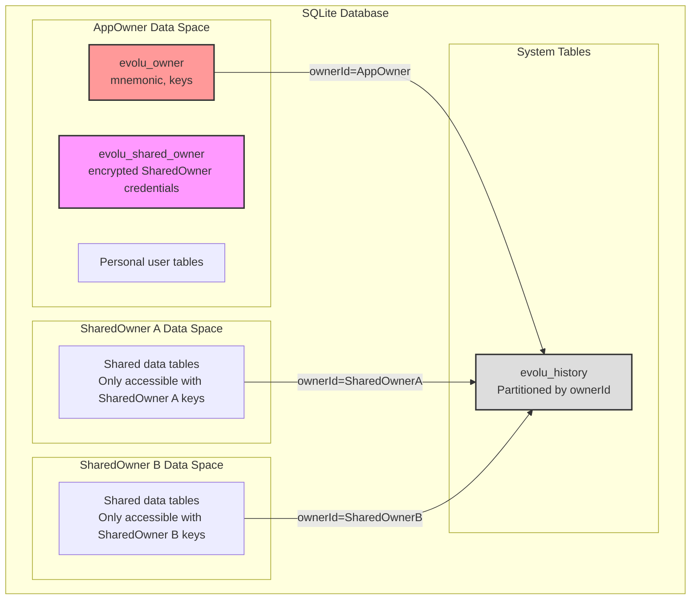
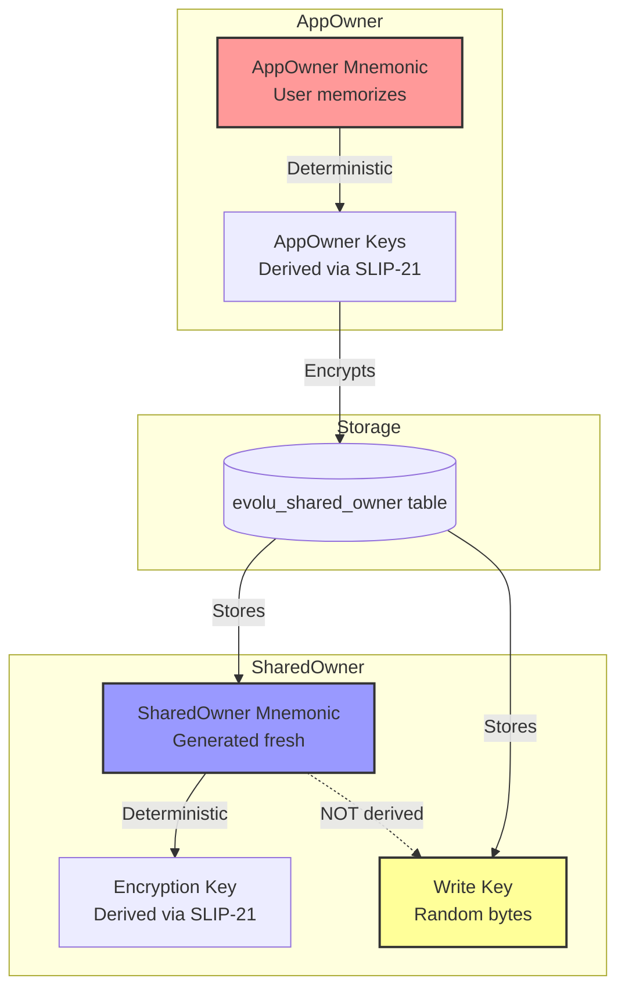
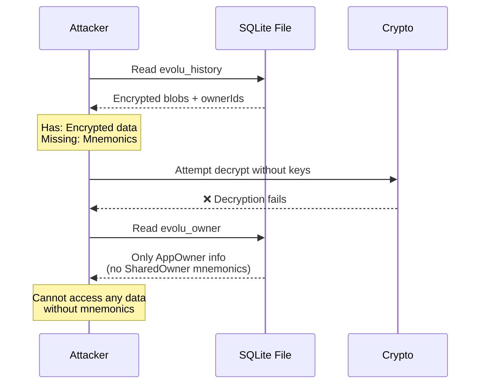
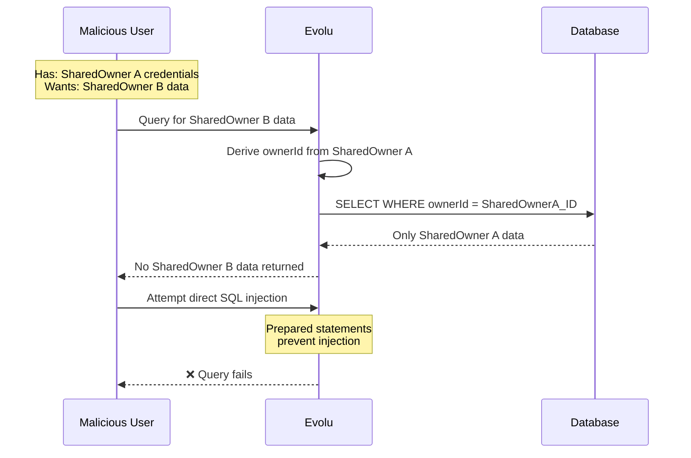
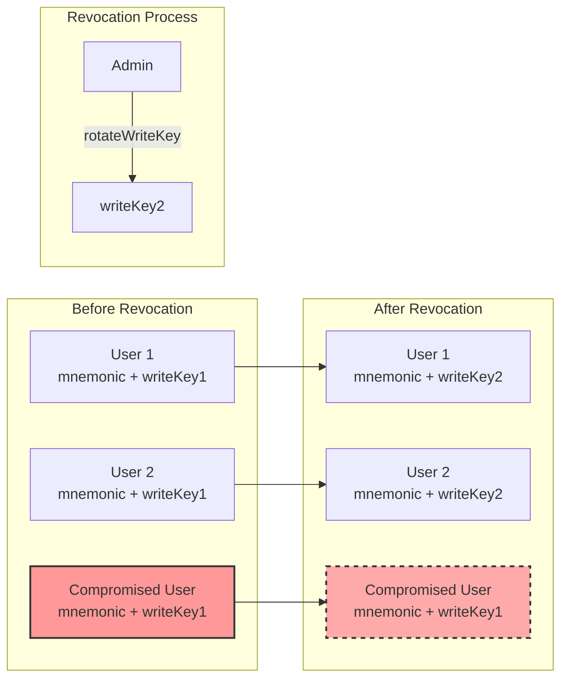
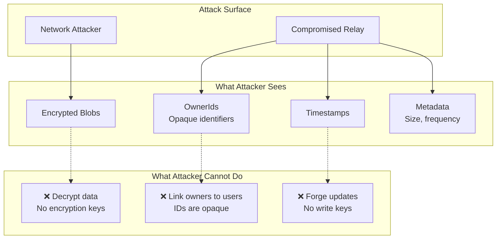
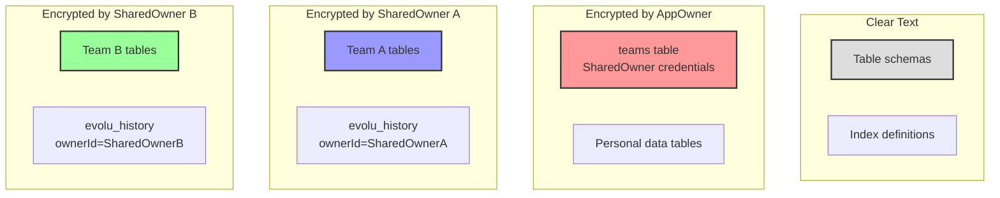
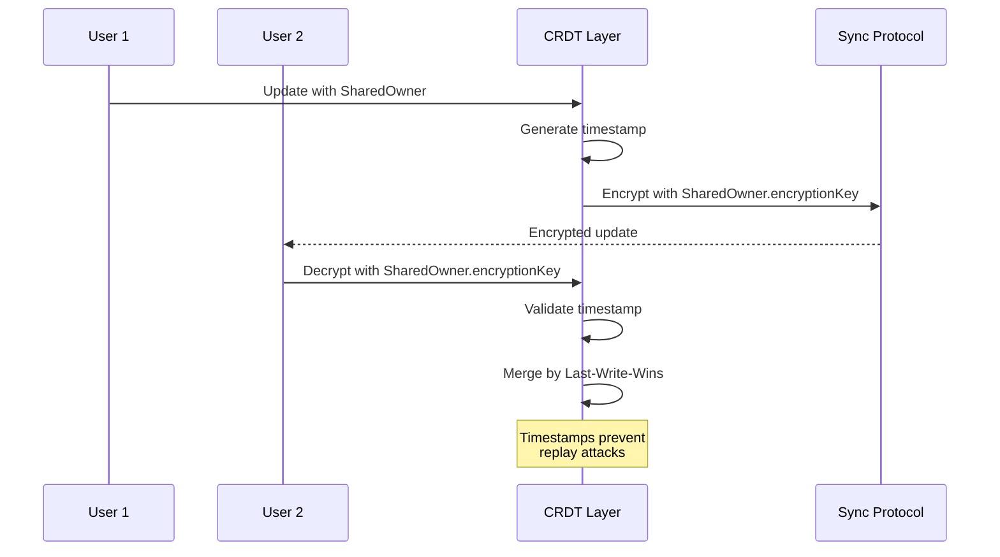
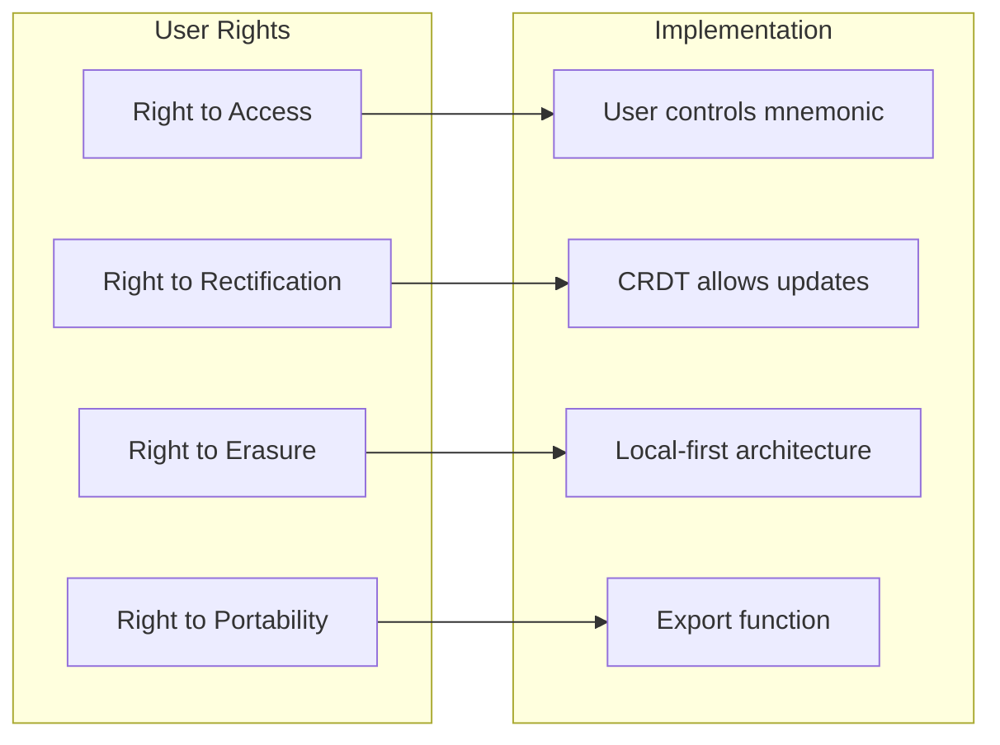

# SharedOwner Security Analysis

## Executive Summary

This document analyzes the security implications of implementing SharedOwner functionality in Evolu. The implementation enables multi-owner data partitioning while maintaining Evolu's cryptographic guarantees and zero-knowledge architecture.

## Core Security Model

### Data Isolation Model



**Key Security Properties:**
- Each ownerId creates a cryptographic boundary
- Data in evolu_history is partitioned by ownerId
- SharedOwner credentials stored encrypted in AppOwner space
- No cross-owner data access possible without keys

## Key Management Architecture

### Key Derivation and Storage



**Security Design Decisions:**
1. **AppOwner mnemonic**: Never stored, user must memorize
2. **SharedOwner mnemonic**: Stored encrypted by AppOwner
3. **SharedOwner writeKey**: Random (not derived) for revocability

### Access Control Levels

```mermaid
stateDiagram-v2
    [*] --> NoAccess
    
    state NoAccess {
        note: No mnemonic = No access
    }
    
    state "Read-Only Access" as ReadOnly {
        note: Has SharedOwner mnemonic only
    }
    
    state "Read-Write Access" as ReadWrite {
        note: Has mnemonic + writeKey
    }
    
    NoAccess --> ReadOnly: Receive mnemonic
    ReadOnly --> ReadWrite: Receive writeKey
    ReadWrite --> ReadOnly: WriteKey revoked
```

## Threat Analysis

### Threat 1: Database File Access

**Scenario**: Attacker gains access to SQLite database file



**Mitigation**: All data encrypted at rest, keys never stored in database

### Threat 2: Malicious Team Member

**Scenario**: Team member attempts unauthorized access



**Mitigation**: Cryptographic isolation by ownerId, prepared statements

### Threat 3: WriteKey Compromise

**Scenario**: Need to revoke write access



**Result**: Compromised user retains read access but loses write access

### Threat 4: Relay/Network Attacks

**Scenario**: Network infrastructure compromise



**Impact**: Limited to metadata analysis and denial of service

## Cryptographic Boundaries

### Encryption Scope



### CRDT Security Properties



## Implementation Security Checklist

### Required Security Measures

- [x] SharedOwner credentials encrypted in user space
- [x] OwnerId derivation uses cryptographic functions
- [x] WriteKey is random, not derived
- [x] All queries use prepared statements
- [x] Owner context validated on every mutation
- [x] No SharedOwner data in evolu_owner table

### Security Invariants

1. **Mnemonic Protection**
   ```typescript
   // INVARIANT: Never log or transmit mnemonics
   assert(typeof sharedOwner.mnemonic === "string");
   // ❌ console.log(sharedOwner.mnemonic);
   // ❌ fetch("/api", { body: JSON.stringify(sharedOwner) });
   ```

2. **Owner Isolation**
   ```typescript
   // INVARIANT: Data filtered by ownerId
   const ownerId = deriveOwnerIdFromOwner(owner);
   sql`SELECT * FROM evolu_history WHERE ownerId = ${ownerId}`;
   ```

3. **Encryption Boundary**
   ```typescript
   // INVARIANT: All user data encrypted before storage
   const encrypted = encrypt(data, owner.encryptionKey);
   sql`INSERT INTO evolu_history (..., value) VALUES (..., ${encrypted})`;
   ```

## Privacy Considerations

### Metadata Leakage

What the relay/network observer can infer:
- Number of owners syncing
- Frequency of updates per owner
- Size of updates
- Timing patterns

What they cannot infer:
- Identity of owners
- Relationship between owners
- Content of data
- Type of application

### GDPR Compliance



## Security Recommendations

### For Evolu Library Users

1. **Secure Credential Storage**
   ```typescript
   // SharedOwner credentials are automatically stored in evolu_shared_owner table
   const sharedOwner = createSharedOwner(deps);
   // Evolu handles storage internally - encrypted by AppOwner
   ```

2. **Access Control Patterns**
   ```typescript
   // Read-only sharing
   const readOnlyAccess = {
     mnemonic: sharedOwner.mnemonic
     // Omit writeKey
   };
   
   // Full access sharing  
   const fullAccess = sharedOwner; // Include writeKey
   ```

3. **Key Rotation**
   ```typescript
   // Rotate compromised writeKey
   const newWriteKey = createWriteKey(deps)();
   const rotated = rotateWriteKey(sharedOwner, newWriteKey);
   // Distribute new writeKey to authorized users
   ```

### For End Users

1. **Mnemonic Hierarchy**
   - AppOwner mnemonic = Master password (memorize, never share)
   - SharedOwner mnemonic = Team invitation (share via secure channel)
   - WriteKey = Edit permission (easily revocable)

2. **Secure Sharing**
   - Use end-to-end encrypted channels for sharing
   - Verify recipient identity before sharing
   - Rotate writeKeys periodically

## Conclusion

The SharedOwner implementation maintains Evolu's security guarantees:
- ✅ Zero-knowledge architecture preserved
- ✅ Cryptographic data isolation 
- ✅ No new attack vectors introduced
- ✅ Granular access control added
- ✅ Key rotation capability included

The design ensures that multi-owner collaboration does not compromise the security properties of the single-owner model.