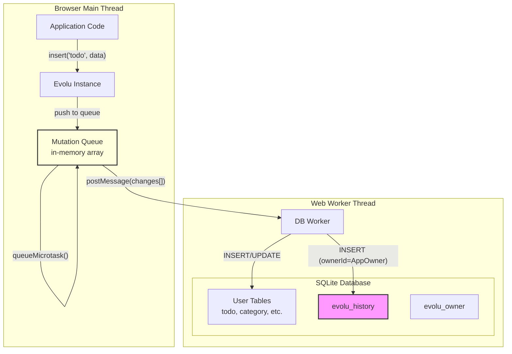
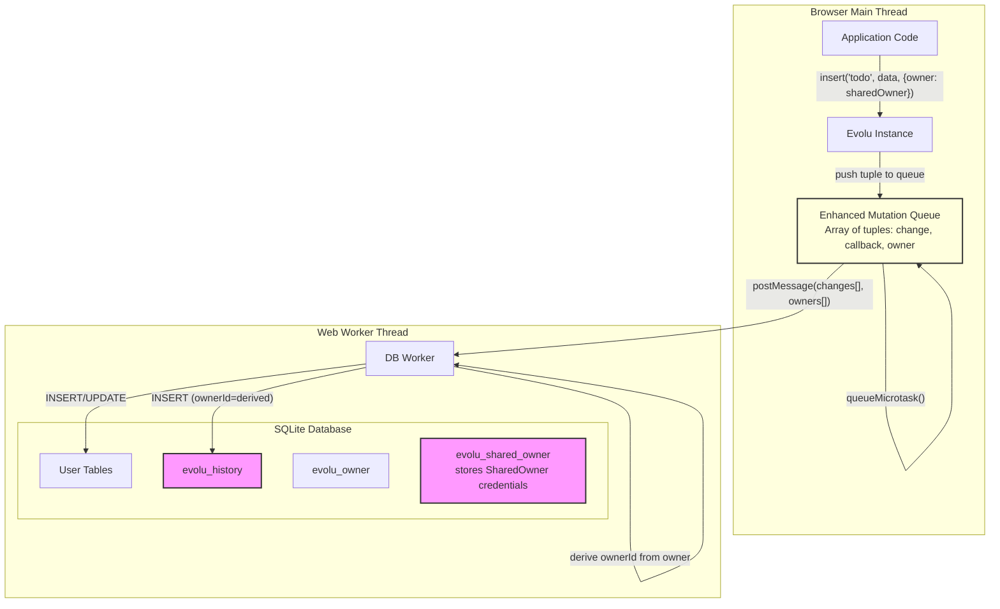
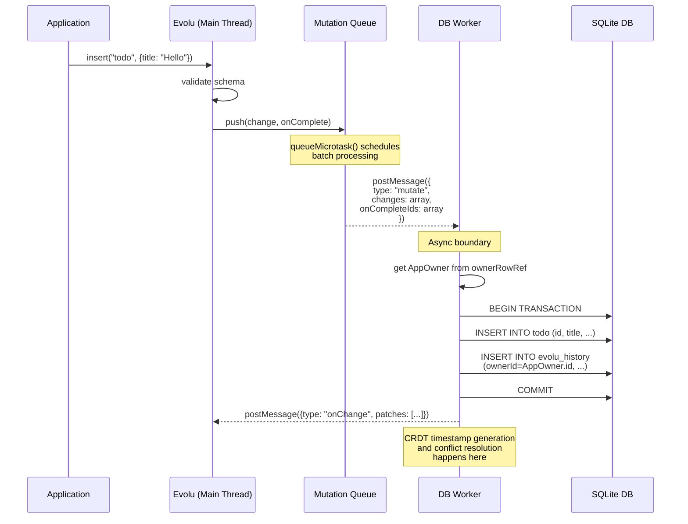
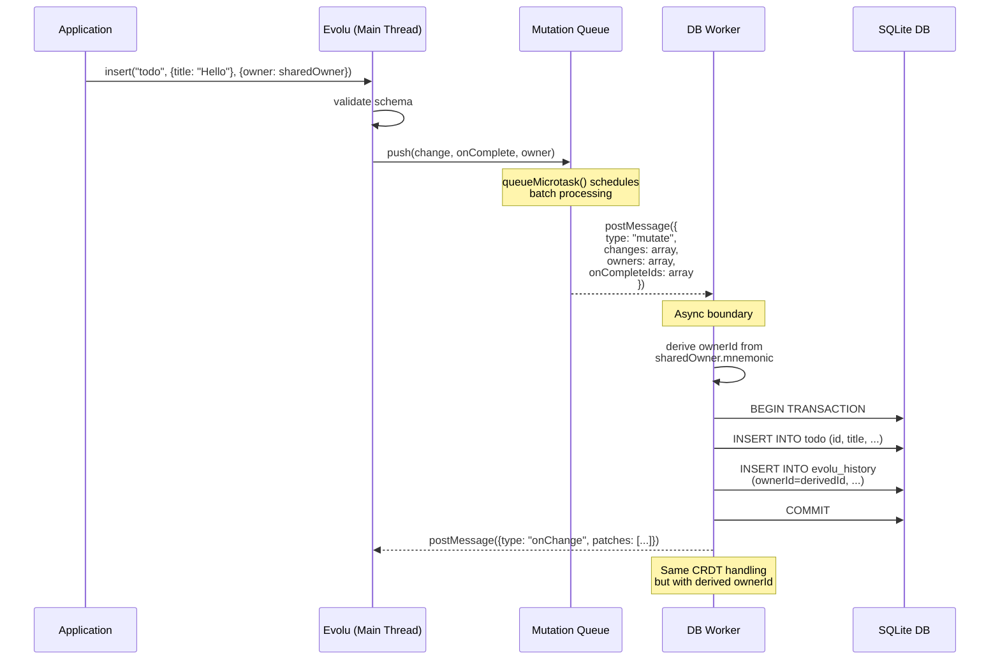
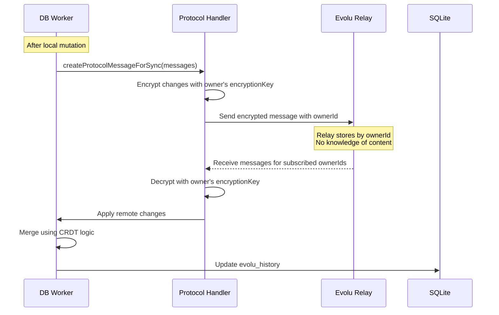
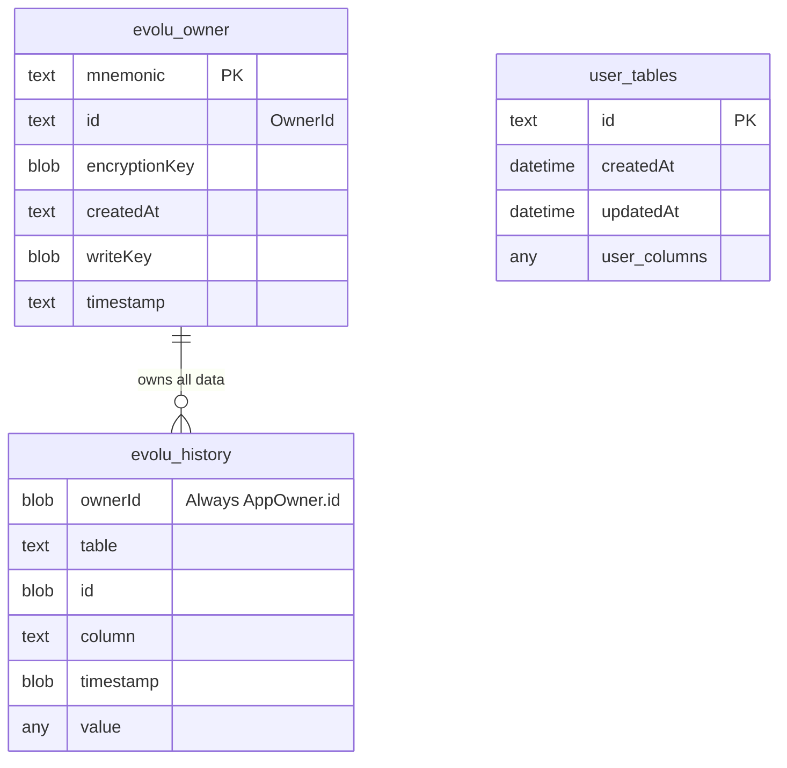
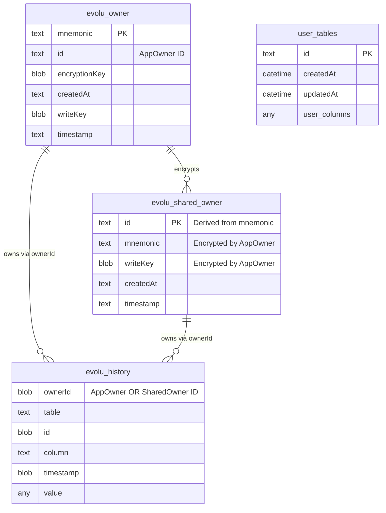

# SharedOwner Technical Design Document

## Overview

This document describes the technical implementation for adding multi-owner support to Evolu through an `options.owner` parameter in mutations. This enables data partitioning by owner for collaborative applications.

## Architecture Overview

### Current Architecture (BEFORE)



**Legend:**
- Yellow: In-memory structures
- Pink: System tables

**Key Points:**
- Mutation queue is an in-memory array in the main thread
- `queueMicrotask()` is a browser API for scheduling microtasks
- All data in `evolu_history` uses the single AppOwner ID

### Proposed Architecture (AFTER)



**Legend:**
- Yellow: In-memory structures
- Pink: System tables (evolu_*)

## Data Flow Analysis

### Current Mutation Flow (BEFORE)



### Proposed Mutation Flow (AFTER)



### Batching and Owner Array Explanation

**Why do we have `{owner: sharedOwner}` in the API but `owners: array` in the message?**

Evolu batches multiple mutations into a single database transaction for performance. When multiple mutations are queued:

```typescript
// Application code - multiple mutations in same microtask
evolu.insert("todo", {title: "Task 1"}, {owner: teamAOwner});
evolu.insert("todo", {title: "Task 2"}, {owner: teamBOwner}); 
evolu.insert("category", {name: "Personal"}); // Default: uses AppOwner

// These get batched into arrays:
changes = [change1, change2, change3];
owners = [teamAOwner, teamBOwner, undefined];

// Worker receives parallel arrays where owners[i] corresponds to changes[i]
```

This design enables:
1. **Batched transactions** - Multiple mutations in one transaction
2. **Mixed ownership** - Different mutations can have different owners in same batch
3. **Default behavior** - Mutations without explicit owner default to AppOwner (undefined in array)

### CRDT Synchronization Flow



## Database Schema

### Current Schema (BEFORE)



### Proposed Schema (AFTER)



Note: SharedOwner is stored in the `evolu_shared_owner` system table, encrypted by the AppOwner's encryption key.

## Implementation Details

### 1. Evolu.ts Changes

#### MutationOptions Interface
```typescript
// In Schema.ts
export interface MutationOptions {
  readonly onComplete?: () => void;
  readonly onlyValidate?: boolean;
  readonly owner?: ShardOwner | SharedOwner; // NEW
}
```

#### Mutation Queue Structure
```typescript
// Current queue structure
const mutateMicrotaskQueue: Array<
  [DbChange | undefined, MutationOptions["onComplete"] | undefined]
> = [];

// Updated queue structure
const mutateMicrotaskQueue: Array<
  [
    DbChange | undefined,
    MutationOptions["onComplete"] | undefined,
    ShardOwner | SharedOwner | undefined, // NEW
  ]
> = [];
```

#### createMutation Function
```typescript
const createMutation = <Kind extends MutationKind>(kind: Kind) =>
  <TableName extends keyof typeof schema>(
    table: TableName,
    props: /* ... */,
    options?: MutationOptions,
  ): Result</* ... */> => {
    // ... validation logic ...
    
    if (options?.onlyValidate !== true) {
      if (!result.ok) {
        mutateMicrotaskQueue.push([undefined, undefined, undefined]);
      } else {
        // ... create dbChange ...
        // Pass owner to queue (undefined = AppOwner)
        mutateMicrotaskQueue.push([
          dbChange, 
          options?.onComplete,
          options?.owner // NEW - defaults to undefined
        ]);
      }
      
      if (mutateMicrotaskQueue.length === 1)
        queueMicrotask(() => {
          const changes: Array<DbChange> = [];
          const onCompletes = [];
          const owners: Array<ShardOwner | SharedOwner | undefined> = []; // NEW
          
          for (const [change, onComplete, owner] of mutateMicrotaskQueue) {
            if (change) {
              changes.push(change);
              owners.push(owner); // NEW
            }
            if (onComplete) onCompletes.push(onComplete);
          }
          
          // ... validation ...
          
          if (isNonEmptyArray(changes))
            dbWorker.postMessage({
              type: "mutate",
              tabId: getTabId(),
              changes,
              owners, // NEW
              onCompleteIds,
              subscribedQueries: subscribedQueries.get(),
            });
        });
    }
    // ... return result ...
  };
```

### 2. Db.ts Changes

#### Message Type Update
```typescript
export interface DbWorkerInputMutate {
  readonly type: "mutate";
  readonly tabId: Id;
  readonly changes: NonEmptyReadonlyArray<DbChange>;
  readonly owners?: ReadonlyArray<ShardOwner | SharedOwner | undefined>; // NEW
  readonly onCompleteIds: ReadonlyArray<CallbackId>;
  readonly subscribedQueries: ReadonlyArray<Query>;
}
```

#### Owner ID Derivation
```typescript
// Reuse existing owner creation logic
const deriveOwnerIdFromOwner = (
  owner: ShardOwner | SharedOwner
): OwnerId => {
  const seed = mnemonicToMnemonicSeed(owner.mnemonic);
  return createSlip21Id(seed, ["Evolu", "Owner Id"]) as OwnerId;
};
```

#### Mutation Handler Update
```typescript
case "mutate": {
  const mutate = deps.sqlite.transaction(() => {
    const toSyncChanges: Array<DbChange> = [];
    const localOnlyChanges: Array<DbChange> = [];
    
    // Separate local-only from syncable changes
    for (const change of message.changes) {
      if (change.table.startsWith("_")) {
        localOnlyChanges.push(change);
      } else {
        toSyncChanges.push(change);
      }
    }
    
    // ... handle localOnlyChanges ...
    
    if (isNonEmptyArray(toSyncChanges)) {
      // Apply changes with owner context
      const result = applyChangesWithOwners(deps)(
        toSyncChanges,
        message.owners // Pass owners array
      );
      if (!result.ok) return result;
    }
    
    return ok();
  });
  
  // ... rest of handler ...
}
```

#### applyChangesWithOwners Implementation
```typescript
const applyChangesWithOwners = (deps: DbWorkerDeps) => (
  changes: NonEmptyReadonlyArray<DbChange>,
  owners?: ReadonlyArray<ShardOwner | SharedOwner | undefined>
): Result<NonEmptyReadonlyArray<CrdtMessage>, TimestampError | SqliteError> => {
  let lastTimestamp = timestampStringToTimestamp(
    deps.ownerRowRef.get().timestamp
  );
  
  const messages: Array<CrdtMessage> = [];
  
  // Process each change with its corresponding owner
  // changes[i] corresponds to owners[i] - parallel arrays pattern
  for (let i = 0; i < changes.length; i++) {
    const change = changes[i];
    const owner = owners?.[i]; // undefined = use default AppOwner
    
    // Derive ownerId for this specific change
    const ownerId = owner
      ? deriveOwnerIdFromOwner(owner)
      : deps.ownerRowRef.get().id; // Default behavior: use AppOwner
    
    const nextTimestamp = sendTimestamp(deps)(lastTimestamp);
    if (!nextTimestamp.ok) return nextTimestamp;
    lastTimestamp = nextTimestamp.value;
    
    messages.push({ timestamp: lastTimestamp, change });
    
    // Apply to history with specific ownerId
    const result = applyMessageToHistoryWithOwner(deps)(
      message,
      ownerId
    );
    if (!result.ok) return result;
  }
  
  // Update owner timestamp
  const timestamp = timestampToTimestampString(lastTimestamp);
  deps.ownerRowRef.modify((owner) => ({ ...owner, timestamp }));
  const saveTimestamp = deps.sqlite.exec(sql`
    update evolu_owner set "timestamp" = ${timestamp};
  `);
  if (!saveTimestamp.ok) return saveTimestamp;
  
  assertNonEmptyReadonlyArray(messages);
  return ok(messages);
};
```

## Testing Strategy

### Unit Tests
1. **Owner ID Derivation**: Verify correct ID generation from mnemonic
2. **Mutation Queue**: Test owner parameter passing
3. **Worker Message Processing**: Verify owners array handling

### Integration Tests
```typescript
test("mutations with SharedOwner use correct ownerId", async () => {
  const sharedOwner = createSharedOwner(deps);
  const expectedOwnerId = deriveOwnerIdFromOwner(sharedOwner);
  
  evolu.insert("item", { name: "Test" }, { owner: sharedOwner });
  
  // Verify evolu_history contains correct ownerId
  const history = await sqlite.exec(sql`
    SELECT ownerId FROM evolu_history 
    WHERE "table" = 'item' 
    ORDER BY timestamp DESC 
    LIMIT 1
  `);
  
  expect(history.rows[0].ownerId).toBe(expectedOwnerId);
});
```

## Migration Notes

- **Database schema change**: Add `evolu_shared_owner` system table
- Backward compatible - existing code continues using AppOwner
- SharedOwner credentials stored in new `evolu_shared_owner` table, encrypted by AppOwner

### New Table Schema

```sql
create table evolu_shared_owner (
  "id" text not null primary key,  -- OwnerId derived from mnemonic
  "mnemonic" blob not null,         -- Encrypted by AppOwner
  "writeKey" blob not null,         -- Encrypted by AppOwner
  "createdAt" text not null,
  "timestamp" text not null         -- For CRDT sync
)
strict;
```