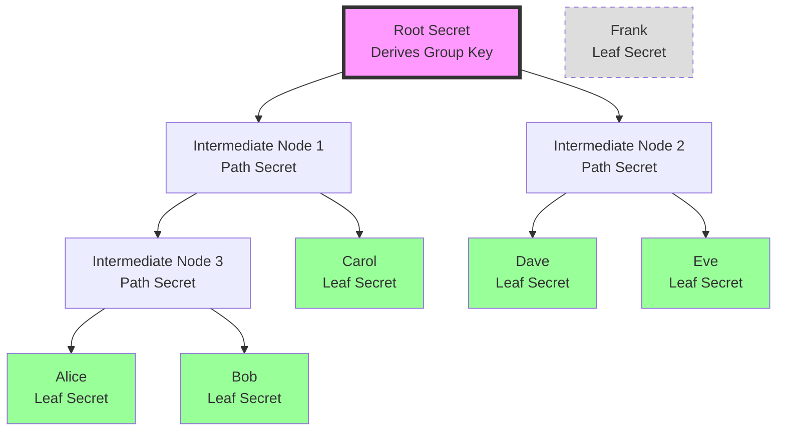
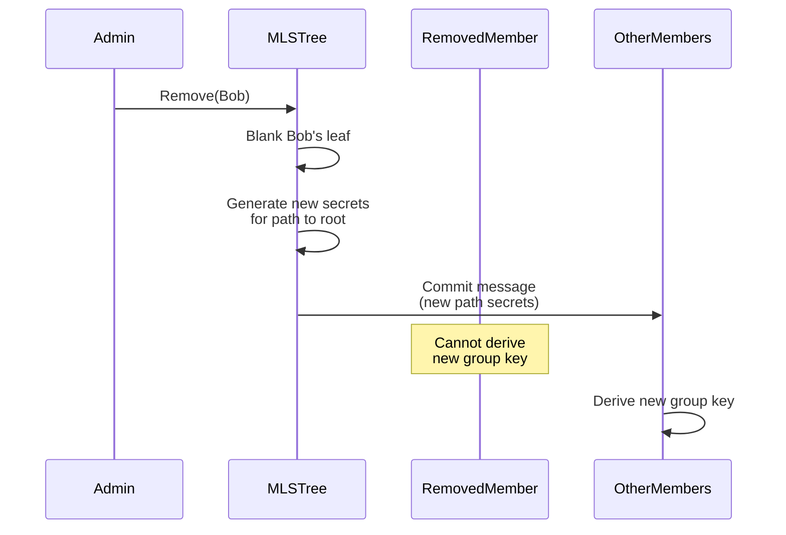

# MLS (Messaging Layer Security) Research Document

## Overview

MLS (Messaging Layer Security) is an IETF standard (RFC 9420) designed to provide end-to-end encryption for group messaging with efficient key management at scale. It's essentially "Signal Protocol for groups" - solving the problem of secure group communication with forward secrecy and post-compromise security.

## The Problem MLS Solves

### Traditional Group Encryption Scaling Issue

```typescript
// Traditional approach - O(N) complexity
function addMemberToGroup(group: Group, newMember: Member) {
  const newGroupKey = generateNewKey();
  
  // Must encrypt new key for EVERY member
  for (const member of [...group.members, newMember]) {
    const encrypted = encryptFor(newGroupKey, member.publicKey);
    send(member, encrypted);
  }
  // Problem: 10,000 members = 10,000 encryptions!
}
```

### Why This Matters
- Adding one member to a large group requires encrypting the new key for every existing member
- Removing a member requires distributing a new key to all remaining members
- Cost grows linearly with group size
- Network overhead becomes prohibitive for large groups

## The Core Problem MLS Solves

Functionally, MLS solves **exactly one problem**: reducing the complexity of key distribution when group membership changes from O(n) to O(log n).

**That's it.** Everything else (forward secrecy, post-compromise security, etc.) are bonus features that come from the tree structure, but the core innovation is making key distribution scale logarithmically instead of linearly.

### What This Means in Practice

For different group sizes:
- **10 members**: Traditional = 10 operations, MLS = 3 operations (3.3x improvement)
- **100 members**: Traditional = 100 operations, MLS = 7 operations (14x improvement)  
- **1,000 members**: Traditional = 1,000 operations, MLS = 10 operations (100x improvement)
- **10,000 members**: Traditional = 10,000 operations, MLS = 13 operations (769x improvement)

The benefit only becomes significant as groups grow large.

## How MLS Works

### Ratchet Tree Structure

MLS uses a binary tree where members occupy leaf nodes and derive the group encryption key from the root:



### Key Concepts

1. **Direct Path**: Each member knows their leaf secret and all secrets on the path to root
2. **Sibling Nodes**: Members don't know secrets of nodes they don't need
3. **Key Derivation**: Group key is derived from root secret
4. **Efficient Updates**: Changing one leaf only requires updating log(N) nodes

## Core Operations

### Adding a Member - O(log N)

```typescript
// MLS approach - logarithmic complexity
function mlsAddMember(tree: MLSTree, newMember: Member) {
  // 1. Find empty leaf position
  const position = tree.findEmptyLeaf();
  
  // 2. Generate new secrets for path to root
  const pathToRoot = tree.getPath(position); // log(N) nodes
  const newSecrets = generatePathSecrets(pathToRoot);
  
  // 3. Create welcome message for new member
  const welcome = {
    position,
    pathSecrets: newSecrets,
    groupContext: tree.getContext()
  };
  
  // 4. Update only affected members (those on the path)
  for (const node of pathToRoot) {
    const affectedMembers = tree.getMembersUnder(node.sibling);
    // Send update only to affected members - O(log N) messages
    sendUpdate(affectedMembers, node.newSecret);
  }
}
```

### Removing a Member



## Security Properties

### 1. Forward Secrecy
- Old keys are deleted after use
- Compromising current state doesn't reveal past messages
- Each epoch has independent key material

### 2. Post-Compromise Security (PCS)
- If a device is compromised then secured, future messages become safe
- Achieved through continuous key ratcheting
- Unique to tree-based protocols

### 3. Membership Authentication
- Every operation is authenticated
- Members can verify group membership
- Prevents unauthorized additions/removals

## Implementation Complexity

### Core Components Required

```typescript
interface MLSImplementation {
  // Tree management
  tree: RatchetTree;
  
  // Cryptographic state
  epoch: bigint;
  epochSecret: Uint8Array;
  
  // Protocol messages
  proposals: ProposalQueue;
  pendingCommit?: Commit;
  
  // Key schedule
  keySchedule: {
    initSecret: Uint8Array;
    senderDataSecret: Uint8Array;
    encryptionSecret: Uint8Array;
    exporterSecret: Uint8Array;
    authenticationSecret: Uint8Array;
    externalSecret: Uint8Array;
    confirmationKey: Uint8Array;
    membershipKey: Uint8Array;
    resumptionPsk: Uint8Array;
  };
}
```

### Message Types

1. **Proposal**: Suggests a change (add/remove/update)
2. **Commit**: Finalizes one or more proposals
3. **Welcome**: Onboards new members with necessary secrets
4. **Application**: Encrypted messages using group key

### State Synchronization Challenge

```typescript
// MLS requires precise state synchronization
class MLSStateMachine {
  async processCommit(commit: Commit): Promise<void> {
    // 1. Verify commit signature
    if (!this.verifySignature(commit)) {
      throw new Error("Invalid commit signature");
    }
    
    // 2. Apply proposals in exact order
    for (const proposal of commit.proposals) {
      this.applyProposal(proposal);
    }
    
    // 3. Update tree hash
    this.treeHash = this.computeTreeHash();
    
    // 4. Advance epoch
    this.epoch++;
    
    // 5. Derive new key schedule
    this.keySchedule = this.deriveKeySchedule(commit.pathSecret);
    
    // Critical: All members must reach identical state
  }
}
```

## MLS vs Other Approaches

### Comparison Table

| Feature | MLS | Signal (Pairwise) | Simple Group Keys | Epoch-Based |
|---------|-----|-------------------|-------------------|-------------|
| Add Member Complexity | O(log N) | O(N) | O(N) | O(1) or O(N) |
| Remove Member Complexity | O(log N) | O(N) | O(N) | O(1) or O(N) |
| Forward Secrecy | Yes | Yes | Depends | Yes |
| Post-Compromise Security | Yes | Yes | No | Partial |
| Implementation Complexity | High | Medium | Low | Medium |
| Standards-Based | RFC 9420 | Signal Spec | No | No |
| State Sync Required | Precise | Pairwise | Simple | Moderate |

### When to Use MLS

**Good Fit:**
- Large groups (100+ members)
- Frequent membership changes
- Need standards compliance
- Security is paramount

**Poor Fit:**
- Small, stable groups
- Simple use cases
- Resource-constrained environments
- Need simple implementation

## Multi-Group Membership Complexity

When users participate in multiple groups, MLS provides **zero optimization**. Each group is completely independent.

### Example Scenario
Users: A, B, C  
Groups: X, Y, Z  
Memberships:
- Group X: Members A, B
- Group Y: Members B, C  
- Group Z: Members C, A

### Independent State Management

Each user must maintain completely separate state for each group:

```typescript
// User B's device must store:
class UserBState {
  groups = {
    X: {
      tree: RatchetTree,        // Full tree for group X
      epoch: 5,
      myLeafIndex: 1,
      pathSecrets: [...],       // log(n) secrets
      treeHash: "abc123..."
    },
    Y: {
      tree: RatchetTree,        // Completely different tree
      epoch: 12,
      myLeafIndex: 0,
      pathSecrets: [...],       // Different secrets
      treeHash: "def456..."
    }
  };
}
```

### No Cross-Group Benefits

Even though B knows A from Group X and C from Group Y, this provides zero benefit:

```typescript
// When B sends to both groups, it's two completely separate operations
async function sendToMyGroups(message: string) {
  // Encrypt for Group X
  const xKey = deriveGroupKey(groups.X);
  const xCiphertext = encrypt(message, xKey);
  
  // Completely separate encryption for Group Y
  const yKey = deriveGroupKey(groups.Y);
  const yCiphertext = encrypt(message, yKey);
  
  // No shared computation, no optimization
}
```

### Storage and Computation Overhead

For a user in N groups with average size M members:
- **Storage per user**: N × O(log M) 
- **Computation for updates**: N separate tree operations
- **Key rotation after compromise**: N separate update protocols

### The "Supergroup" Anti-Pattern

You might think: "Why not create one group with everyone and use subsets?" This fails because:
1. Violates principle of least privilege (everyone sees all member changes)
2. Single massive tree for all users
3. Any update affects everyone's state

## MLS for Small Groups: Overkill?

For small group chat applications (12-15 member cap), MLS is likely overkill.

### Small Group Analysis

For a 15-member group:
- **Traditional approach**: 15 encryptions on member change
- **MLS approach**: ~4 encryptions (log₂(15) ≈ 3.9)
- **Improvement**: Only 3.75x

But consider the complexity cost:
- Implement and maintain ratchet tree
- Handle state synchronization perfectly
- Manage tree rebalancing
- Deal with concurrent operations
- Store path secrets for each member

### When MLS Becomes Worthwhile

The crossover point where MLS complexity pays off:

| Group Size | Traditional Ops | MLS Ops | Improvement | Worth It? |
|------------|----------------|---------|-------------|-----------|
| 10         | 10             | 3       | 3.3x        | ❌ No     |
| 20         | 20             | 4       | 5x          | ❌ No     |
| 50         | 50             | 6       | 8.3x        | 🤔 Maybe  |
| 100        | 100            | 7       | 14x         | ✅ Yes    |
| 500        | 500            | 9       | 55x         | ✅ Yes    |

For groups under 50 members, simpler approaches are usually better.

### Better Alternatives for Small Groups

1. **Simple Symmetric Key with Rotation**
   ```typescript
   // For 15 members, this is much simpler
   function rotateGroupKey(group: SmallGroup) {
     const newKey = generateKey();
     for (const member of group.members) {  // Only 15 iterations
       sendEncrypted(member, newKey);
     }
   }
   ```

2. **Sender Keys (Signal-style)**
   - Each member has their own sender key
   - Simpler state management
   - Good for small, stable groups

3. **Time-Based Epochs**
   - Rotate keys on schedule, not on membership change
   - Much simpler implementation
   - Fine for groups with infrequent changes

## Challenges for CRDT Systems

### 1. Ordering Requirements
MLS assumes operations are processed in order, but CRDTs are designed for concurrent, out-of-order operations:

```typescript
// MLS expects this
processOperations([add(Alice), remove(Bob), add(Carol)]); // Specific order

// CRDTs allow this
merge(
  deviceA: [add(Alice), add(Carol)],
  deviceB: [remove(Bob), add(Carol), add(Alice)]
); // Any order, same result
```

### 2. State Divergence
MLS requires all members to have identical tree state:

```typescript
// MLS requirement
assert(deviceA.treeHash === deviceB.treeHash);

// CRDT philosophy
// Devices can have different states that eventually converge
```

### 3. Epoch Synchronization
- MLS epochs must advance in lockstep
- CRDTs allow devices to be at different "times"
- Reconciling these models is non-trivial

## Forward Secrecy Without MLS

### Alternative Approaches

1. **Time-Based Key Rotation**
   ```typescript
   // Rotate keys every hour
   if (Date.now() - lastRotation > HOUR) {
     deriveNewKey(currentKey, time);
   }
   ```

2. **Message-Based Ratcheting**
   ```typescript
   // New key for every N messages
   if (messageCount % 100 === 0) {
     ratchetForward();
   }
   ```

3. **Hybrid Approach**
   ```typescript
   // Use simpler mechanism for small groups
   if (group.size < 50) {
     useSimpleRotation();
   } else {
     useMLS();
   }
   ```

## Recommendations for Evolu Groups

### Consider MLS If:
1. Groups regularly exceed 100 members
2. Membership changes are frequent
3. Regulatory compliance requires standards
4. Post-compromise security is critical

### Skip MLS If:
1. Groups are typically small (< 50)
2. Membership is relatively stable
3. Implementation simplicity is important
4. CRDT semantics are more important than MLS guarantees

### Hybrid Possibility
```typescript
interface EvoluGroupSecurity {
  // Use MLS for large groups
  largeGroupProtocol: MLSProtocol;
  
  // Simple forward secrecy for small groups
  smallGroupProtocol: EpochBasedProtocol;
  
  // Threshold for switching
  readonly threshold = 50;
  
  selectProtocol(groupSize: number): Protocol {
    return groupSize > this.threshold 
      ? this.largeGroupProtocol 
      : this.smallGroupProtocol;
  }
}
```

## Conclusion

MLS is a powerful protocol for secure group messaging at scale, but its complexity and strict synchronization requirements may not align well with CRDT-based systems like Evolu. The key innovation - tree-based key distribution for O(log N) scaling - is valuable for large groups but may be overkill for smaller collaborations.

For Evolu Groups, a pragmatic approach might be:
1. Start with simpler forward secrecy mechanisms
2. Monitor real-world group sizes and update patterns
3. Consider MLS as an optional protocol for large groups
4. Focus on CRDT-friendly security models initially

## References

- [RFC 9420: The Messaging Layer Security (MLS) Protocol](https://www.rfc-editor.org/rfc/rfc9420.html)
- [MLS Architecture](https://www.rfc-editor.org/rfc/rfc9420.html#name-architecture)
- [MLS Security Properties](https://www.rfc-editor.org/rfc/rfc9420.html#name-security-properties)
- [Wire's MLS Implementation](https://github.com/wireapp/core-crypto)
- [Matrix's MLS Research](https://arewemlsyet.com/)